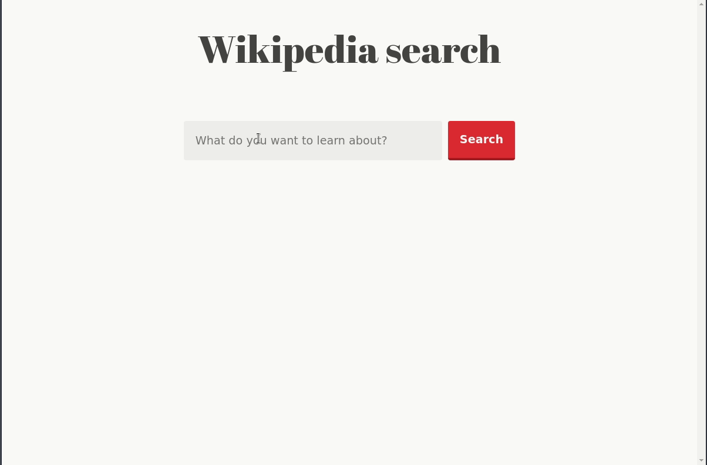

# Infinite scroll demo using the IntersectionObserver API
A quick demonstration of how to do make an infinitely scrolling page using the
[Intersection Observer API](https://developer.mozilla.org/en-US/docs/Web/API/Intersection_Observer_API)
and [React hooks](https://reactjs.org/docs/hooks-intro.html).
Play around with it 
[here](https://sroelants.github.io/intersection_observer_demo).
Read the accompanying blog post [here]().

## Features
- Intersection Observer API
- React Refs for DOM referencing
- A couple of built-in React hooks a custom `useIntersecting` hook

## Installation
- `git clone https://github.com/sroelants/intersection_observer_demo.git`
- `cd intersection_observer_demo/`
- `npm install`
- `npm start`
